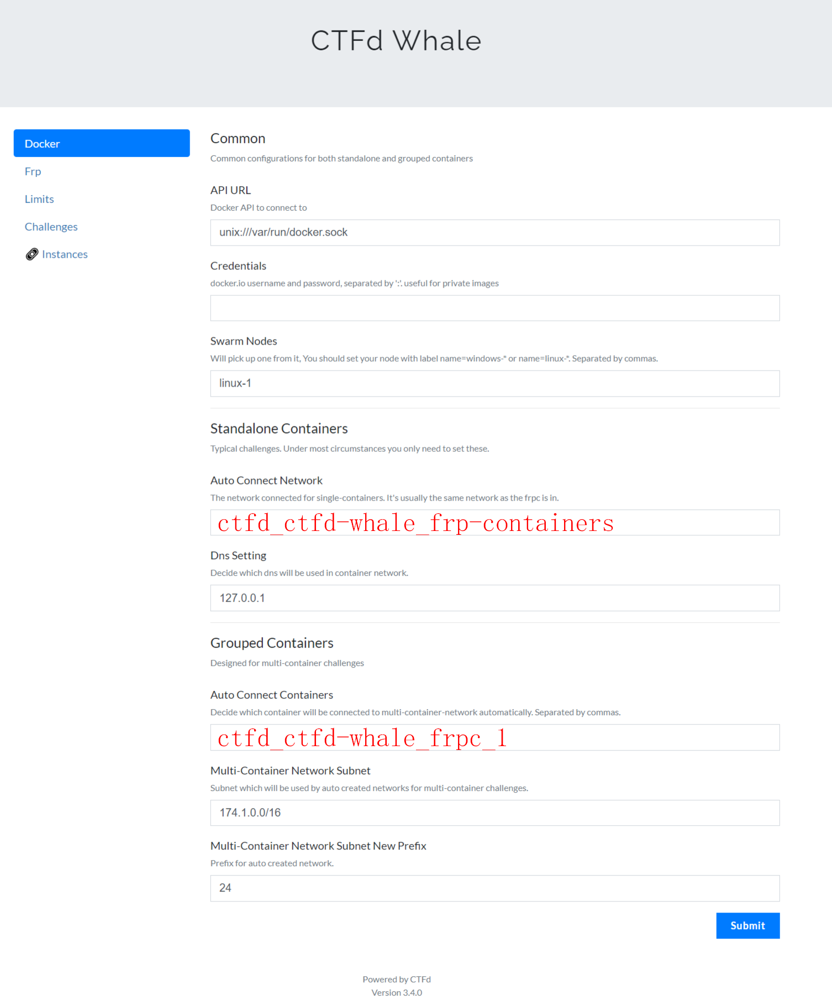
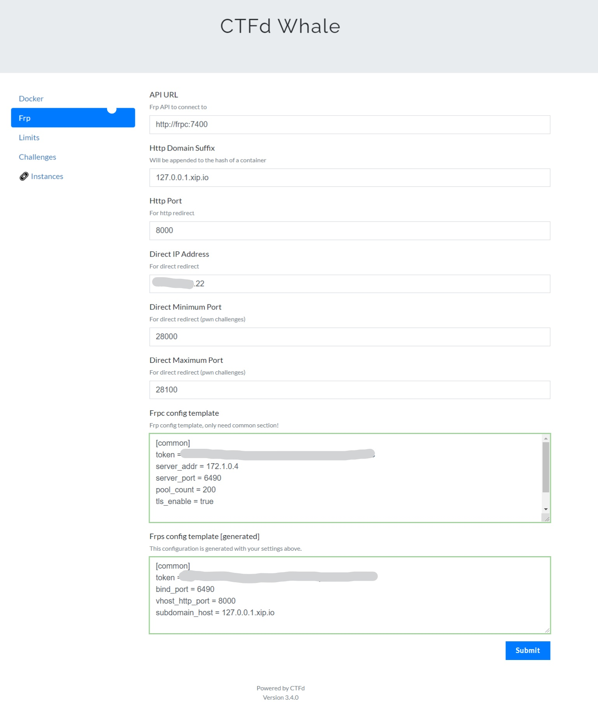

# CTFd动态靶场+题目动态Flag搭建

## 前言

本次将介绍如何从零搭建支持动态靶机和动态Flag的CTFd靶场。虽然这个框架已经有了很多教程，但我在搭建过程中查阅这些资料时发现它们大多都过时，或者有不少错误。本人在搭建的过程中也是把该踩的坑都踩了一遍（还是太弱了），所以特意记录下来，希望可以大家交流学习。

在这里特别感谢[赵师傅](https://www.zhaoj.in/)和其他师傅的文章指导，我们主要用到了赵师傅开发的插件[ctf-whale](https://github.com/glzjin/CTFd-Whale)，这里感谢赵师傅和其他各位师父们！


## 版本说明

本次项目是基于`CTFd3.4`进行搭建，本机使用`Ubuntu20.04`，`docker 20.10.11`，`docker-compose 1.29.2`


## 要求

1. 准备好一台Linux主机，可以是VPS或者虚拟机，但一定要保证网络没有问题
2. 熟悉Linux基本操作


## 环境准备

### 系统换源

更换国内源，已经更换过的可以跳过。

```
sudo vim /etc/apt/sources.list
```

```
#添加阿里源
deb http://mirrors.aliyun.com/ubuntu/ focal main restricted universe multiverse
deb-src http://mirrors.aliyun.com/ubuntu/ focal main restricted universe multiverse
deb http://mirrors.aliyun.com/ubuntu/ focal-security main restricted universe multiverse
deb-src http://mirrors.aliyun.com/ubuntu/ focal-security main restricted universe multiverse
deb http://mirrors.aliyun.com/ubuntu/ focal-updates main restricted universe multiverse
deb-src http://mirrors.aliyun.com/ubuntu/ focal-updates main restricted universe multiverse
deb http://mirrors.aliyun.com/ubuntu/ focal-proposed main restricted universe multiverse
deb-src http://mirrors.aliyun.com/ubuntu/ focal-proposed main restricted universe multiverse
deb http://mirrors.aliyun.com/ubuntu/ focal-backports main restricted universe multiverse
deb-src http://mirrors.aliyun.com/ubuntu/ focal-backports main restricted universe multiverse
```

**更新源**

```text
sudo apt-get -y update
```

**如出现依赖问题，解决方式如下：**

```text
sudo apt-get -f install
```

**更新软件**

```text
sudo apt-get -y upgrade
```


## 安装Docker&docker-compose

### Docker安装

```
sudo curl -fsSL https://get.docker.com | bash -s docker --mirror Aliyun
```

###  docker-compose安装

这里需要pip3的环境，Ubuntu20.04默认有，其他版本系统注意一下自己的环境。

```
sudo pip3 install docker-compose -i https://pypi.tuna.tsinghua.edu.cn/simple
```

### 配置Docker集群的模式

由于赵师傅的插件使用的是集群的模式，所以这里要创建一个单服务器集群。

```
sudo docker swarm init
```

然后将这个服务器加入集群。

```
sudo docker node update --label-add name=linux-1 <节点 ID>
sudo docker node ls
```


### Docker更换镜像源

由于镜像服务可能出现宕机，建议同时配置多个镜像。这里一定要保证该文件符合 json 规范，否则 Docker 将不能启动。

```
sudo vim /etc/docker/daemon.json
```

```
{
  "registry-mirrors": [
    "https://hub-mirror.c.163.com",
    "https://mirror.baidubce.com"
  ]
}
```

重新启动服务

```
sudo systemctl daemon-reload && systemctl restart docker
```


## 安装CTFd

这里就用我打包好的环境，经过我的测试是没有问题的，包括CTFd+ctfd-whale等，且已经更换过国内源。

```.
git clone https://github.com/antlers12/CTFd_CTFd-whale.git
```

进入目录修改一下frps和frpc各自目录下的`frps.ini`和`frpc.ini`文件

**frps.ini：**

```
[common]
bind_port = 6490
token = xxxx # 这里填随机字符串就行，但要保证两个token一样
```

**frpc.ini**

```
[common]
token = xxxx
server_addr = 172.1.0.4
server_port = 6490
pool_count = 200
tls_enable = true

admin_addr = 172.1.0.3
admin_port = 7400
```

**关于frp的说明：**frp不是装在真实机上的，其中的frps与frpc都是在docker里的。frpc是在ctfd里的，frps是在docker机里的。有些教程写的问题大多在这里，还是幸亏看到有师傅写到这里，那我这里就在强调一下。

查看CTFd的文件是否有权限，我这里就把权限都给了

``` 
sudo chmod 744 *.sh *.py
```

之后直接在有`docker-compose.yml`的目录下启动CTFd靶场

```
sudo docker-compose up -d
```

**注意：如果你用的是VPS，记得现在去服务器商放行一下`80,8000,28000-28100`端口。**

稍等一下访问 [http://ip:8000](http://ip:8000/) 就可以看到那个熟悉的靶场了！


## 配置CTFd

在基础配置后，我们需要对CTFd-Whale插件进行配置。
```
docker network ls   # 查看网络信息

docker network inspect ctfd_frp   # 显示ctfd_frp网络的详细信息
```





**参考模板**

```
[common]
token = xxxx # 这里和之前填过的token一样
server_addr = 172.1.0.4
server_port = 6490
pool_count = 200
tls_enable = true

admin_addr = 172.1.0.3
admin_port = 7400
```

到这里没有问题的话，你的靶场就成功搭建完成了。


## 出题&设置动态flag

> 参考：https://penguincc.top/archives/23/

先说一下目的，我需要本地出完题目后，生成镜像，最后push到自己的DockerHub上。

再生成题目镜像中有两种方法

1. 拉一个的基础镜像（包含动态flag环境）来出题，再将容器生成一个新的镜像。

   优点：快捷；缺点：flag的位置和格式不能变化

2. 从头开始出题，自由定制所需要的环境。

   优点：自由；缺点：可能会遇到各种问题，且最后的镜像需要使用Dockerfile构建，否则可能无法使用动态flag

这里推荐方法一，我们还是要简化出题的过程，避免在这方面浪费时间。

我们可以使用到virink写的[base_image_nginx_mysql_php_56](https://github.com/ctfhub-team/base_web_nginx_mysql_php_56)来辅助我们快速出题。

这个镜像主要好在不需要我们去配置其他的nginx设置，而且还支持自动导入db.sql文件，支持自动执行flag.sh文件。

可以参考这个来进行出题：[challenge_gyctf_2020_web_babyphp](https://github.com/ctfhub-team/challenge_gyctf_2020_web_babyphp)

要注意其中几个文件:`flag.sh`，`flag.php`，其中`flag.sh`中的这一条命令。

```
sed -i "s#FLAGFLAGFLAG#$FLAG#" /var/www/html/flag.php || true
```

这里的`FLAGFLAGFLAG`字符串要对应docker题目容器中的`flag.php`，Docker的环境变量会根据文件位置`/var/www/html/flag.php`查找这个字符串：`FLAGFLAGFLAG`来替换CTFd的动态flag。

```
<?php
$flag = "FLAGFLAGFLAG";
```

当然也可以根据自己的配置进行更改，如果需要其他环境，还可以直接访问[ctfhub-team](https://github.com/orgs/ctfhub-team/repositories)的库去寻找。

题目容器测试运行正常后，我们生成镜像上传到DockerHub上（这里需要提前建立一个仓库，例如我这里就叫antlers12/upload-labs11）。

```
# 先登录一下
sudo docker login

# 打包正在运行的容器,这里名字自己取,标签不打默认是latest
sudo docker commit <容器ID> [仓库]:[标签]

# 重新打个tag,这里的antlers12是我的Docker用户名,upload-labs是建立的存储库
sudo docker tag [仓库]:[标签] antlers12/upload-labs11

# push到DockerHub上
sudo docker push antlers12/upload-labs11
```


## CTFd上架动态靶机题

这里没什么好说的，出题选择`dynamic_docker`模式，就是注意其中`Docker Image`选择我们题目镜像，`Frp Redirect Port`对应容器内的端口，通常是80端口，最后CTFd会让你给这道题的flag，我们直接留空就好了。

至此，环境部署完成，可以开始快乐的做题了！


## CTFd记分牌插件

如果需要查询每个人具体的做题情况，我们可以使用一个记分牌的插件进行查看，我本地Fork了一个适用于CTFdv3.0的插件[ctfd-matrix-scoreboard-plugin](https://github.com/antlers12/ctfd-matrix-scoreboard-plugin)

我们可以将插件放入CTFd/plugins再重启CTFd


## 参考链接

https://err0r.top/article/CTFD/#

https://penguincc.top/archives/23/

https://www.cnblogs.com/diantong/p/11519467.html

